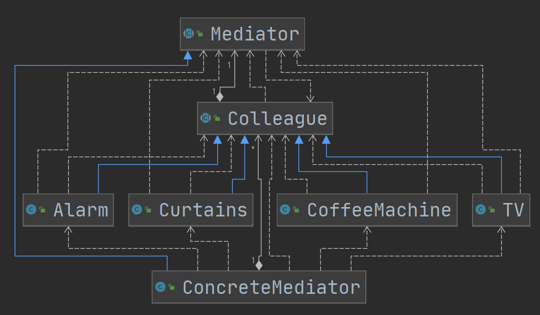

# 中介者模式

## 介绍

1. 中介者模式（Mediator Pattern），**用一个中介对象来封装一些类的对象交互**。中介者使每个对象不需要显式地相互引用，从而使其**耦合松散**，而且可以独立改变他们之间的交互。
2. 中介者模式属于**行为型模式**，使代码易于维护。
3. **MVC模式**，C（Controller控制器）使M（Model模型）和V（View视图）的中介者，在前后端交互时起到中间人的作用

## 类图

中介者模式将`Colleague`子类的网状耦合，分类为以`Mediator`为中心的星状。

1）Mediator就是抽象中介者,定义了同事对象到中介者对象的接口

2）Colleague是抽象同事类

3）ConcreteMediator 具体的中介者对象，实现抽象方法，他需要知道所有的具体的同事类,即以一个集合来管理HashMap,并接受某个同

事对象消息，完成相应的任务

4）ConcreteColleague具体的同事类，会有很多,每个同事只知道自己的行为，而不了解其他同事类的行为(方法)，但是他们都依赖中介者

对象

## 小结

1）多个类相互耦合，会形成**网状结构**，使用中介者模式将网状结构**分离为星型结构**，进行解耦

2）减少类间依赖，降低了耦合，**符合迪米特原则**

3）**中介者承担了较多的责任**，一旦中介者出现了问题，整个系统就会受到影响

4）如果设计不当，中介者对象本身变得过于复杂，这点在实际使用时，要特别注意。