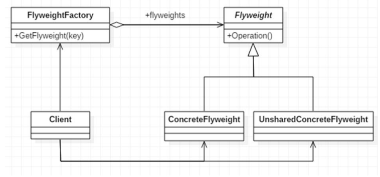

# 享元模式

## 介绍

1. 享元模式也叫蝇量模式，是一种**共享技术**
2. 可以用来**解决系统的性能问题**，如数据库连接池、线程池。避免重复创建，如果没有我们需要的，则创建
3. **解决重复对象的内存浪费问题**，如Java的字符串常量池，当系统中有大量相似的对象，就使用缓冲池，可以降低系统内存，提高效率。
4. 享元模式的**经典应用场景**就是**池技术**。


## 类图




### 角色

1. FlyWeight：抽象的享元角色，定义了对象的外部状态和内部状态的接口。
2. ConcreteFlyWeight：具体的享元角色。
3. UnShareConcreteFlyWeight：不可共享的角色，一般不出现在享元工厂。
4. FlyWeightFactory：享元工厂类，用于构建一个池容器（集合），提供从池中获取对象的方法。


## 内部状态和外部状态

比如围棋、五子棋、跳棋，它们都有大量的棋子对象，围棋和五子棋只有黑白两色，跳棋颜色多一点，所以棋子颜色就是棋子的内部状

态;而各个棋子之间的差别就是位置的不同，当我们落子后，落子颜色是定的，但位置是变化的，所以棋子坐标就是棋子的外部状态

1) 享元模式提出了两个要求:细粒度和共享对象。这里就涉及到内部状态和外部状态了，即将对象的信息分为两个部分:内部状态和外部状态

2) 内部状态指**对象共享出来的信息，**存储在享元对象内部且不会随环境的改变而改变

3) 外部状态指**对象得以依赖的一个标记**，是**随环境改变而改变的、不可共享的状态**。

4)举个例子:围棋理论上有361个空位可以放棋子，每盘棋都有可能有两三百个棋子对象产生，因为内存空间有限，一台服务器很难支持更

多的玩家玩围棋游戏，如果用享元模式来处理棋子，那么棋子对象就可以**减少到只有两个实例**，使用时**通过引用并设置坐标属性（外部状态）**，这样就很好的解决了对象的开销问题


## 代码示例

```java
/**
 * 享元工厂类
 */
public class WebSiteFactory {

    private static HashMap<String,WebSite> pool = new HashMap <>();

    public static WebSite getWebSite(String type){
        WebSite webSite = pool.get(type);
        if(webSite == null){
            webSite = new ConcreteWebSite(type);
            pool.put(type,webSite);
        }
        return webSite;
    }
}
```


```java
/**
 * 具体享元类
 */
public class ConcreteWebSite implements WebSite {
    /**
     * 这是内部状态，可共享 享元的元
     */
    private String type;

    public ConcreteWebSite(String type) {
        this.type = type;
    }

    /**
     * User 为外部状态，用来标记，不同的user可以用同一个ConcreteWebsite
     */
    @Override
    public void use(User user) {
        System.out.println(type + user.getName() );
    }
}
```

