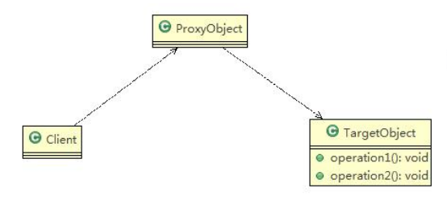

# 代理模式

## 介绍

1. 为一个对象提供一个替身，以控制对象这个对象的访问。即通过代理对象访问目标对象，实现在目标对象的基础上，增强额外的功能操作，扩展目标对象的功能。
2. 被代理的对象可以是远程对象、创建开销大的对象或需要安全控制的对象。
3. 主要有三种代理：静态代理、动态代理（JDK代理、接口代理）和Cglib代理（可以在内存动态的创建对象，而不需要实现接口）

## 类图

## 分类

### 静态代理

#### 优缺点

优点：在不修改目标对象的功能前提下，通过代理对象对目标功能扩展

缺点：代理对象需要与目标对象实现一样的接口，所以会产生很多代理类

一旦接口增加方法，目标对象与代理对象都要维护

### 动态代理

#### 介绍

1. 代理对象不需要实现接口，但是**目标对象必须实现接口**，否则不能动态代理。
2. 代理对象的生成，是利用JDK的API动态的在内存中构建代理对象
3. 动态代理也叫做：JDK代理，接口代理

### Cglib代理

#### 介绍

1) 静态代理和JDK代理模式都要求目标对象是实现一个接口,但是有时候目标对象只是一个单独的对象,并没有实

现任何的接口,这个时候可使用**目标对象子类来实现代理**-这就是Cglib代理

2) Cglib代理也叫作**子类代理**,它是在内存中**构建一个子类对象**从而实现对目标对象功能扩展，有些书也将Cglib代理归属到动态代理。

3) Cglib是一个强大的高性能的代码生成包,它可以在运行期扩展java类与实现java接口.它广泛的被许多AOP的框

架使用,例如Spring AOP，实现方法拦截

4)在AOP编程中如何选择代理模式:

1. 目标对象需要实现接口，用JDK代理

2. 目标对象不需要实现接口，用Cglib代理

5) Cglib包的底层是通过使用字节码处理框架ASM来转换字节码并生成新的类

6）代理的里不能为finnal，否则报错`java.lang.IllegalArgumentException`

7）目标对象的方法如果为final/static，那么就不会被拦截，即不会执行目标对象额外的业务方法。

## 几种常见的代理模式介绍

1）防火墙代理

内网通过代理穿透防火墙，实现对公网的访问。

2)缓存代理
比如:当请求图片文件等资源时，先到缓存代理取，如果取到资源则ok,如果取不到资源，再到公网或者数据库

取，然后缓存。

3）远程代理
远程对象的本地代表，通过它可以把远程对象当本地对象来调用。远程代理通过网络和真正的远程对象沟通信

息。
4）同步代理:主要使用在多线程编程中，完成多线程间同步工作
