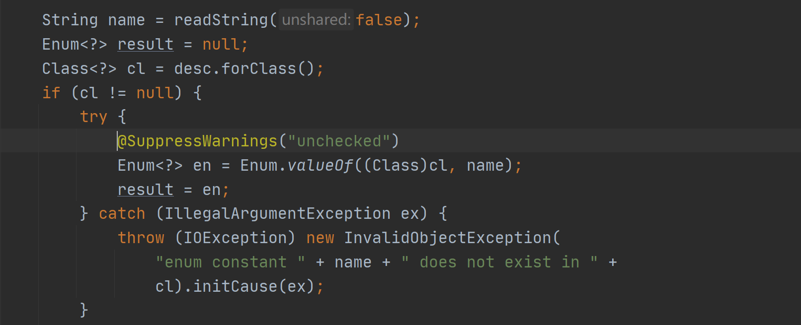

# 单例模式介绍

## 简介

单例设计模式就是保证一个类在一个软件系统中值存在一个对象实例，并且该类提供一个取得其对象实例的方法（静态方法）。

## 适用场景

需要频繁进行创建和销毁的对象

创建对象时耗时过多或耗费资源过多

工具类对象

频繁访问的对象（如数据源、session工厂）

## 分类

### 1）饿汉式（静态常量）

```java
/**
 * 饿汉式（静态变量）
 * 优点：写法简单，在类装载时就完成了实例化，避免线程同步问题
 * 缺点：在类装载时就完成了实例化，可能导致内存浪费
 */
public class Singleton01 {

    /**
     * 私有化构造方法
     */
    private Singleton01(){ }

    private final static Singleton01 instance = new Singleton01();

    public static Singleton01 getInstance(){
        return instance;
    }

}
```


### 2）饿汉式（静态代码块）

```java
/**
 * 饿汉式（静态代码块）
 * 优点：写法简单，在类装载时就完成了实例化，避免线程同步问题
 * 缺点：在类装载时就完成了实例化，可能导致内存浪费
 */
public class Singleton02 {

    /**
     * 私有化构造方法
     */
    private Singleton02(){ }

    private static Singleton02 instance;
    static {
        //在静态代码块，创建实例对象
        instance = new Singleton02();
    }

    public static Singleton02 getInstance(){
        return instance;
    }

}
```


### 3）懒汉式（线程不安全）

```java
/**
 * 懒汉式（线程不安全）
 * 优点：起到了懒加载效果
 * 缺点：在多线程下可能多个线程同时进入if（instance == null），导致产生多个实例
 * 结论：只能在单线程下使用，在实际开发中不要使用
 */
public class Singleton01 {

    /**
     * 私有化构造方法
     */
    private Singleton01(){ }

    private static Singleton01 instance;

    /**
     * 当使用到时，才创建对象实例
     */
    public static Singleton01 getInstance(){
        if(instance == null){
            instance = new Singleton01();
        }
        return instance;
    }
}
```


### 4）懒汉式（线程安全，同步方法）

```java
/**
 * 懒汉式（线程安全，同步方法）
 * 缺点：效率太低，执行getInstance方法每次都要同步，实际上只需要实例化一次对象，后续执行方法直接return即可
 * 不推荐使用
 */
public class Singleton02 {

    /**
     * 私有化构造方法
     */
    private Singleton02(){ }

    private static Singleton02 instance;

    /**
     * 加入同步代码，解决线程不安全问题
     * @return
     */
    public static synchronized Singleton02 getInstance(){
        if(instance == null){
            instance = new Singleton02();
        }
        return instance;
    }

}
```


### 5）懒汉式（线程不安全，同步代码块）

```java
/**
 * 懒汉式（线程不安全，同步代码块）
 * 不能使用
 */
public class Singleton03 {

    /**
     * 私有化构造方法
     */
    private Singleton03(){ }

    private static Singleton03 instance;


    public static Singleton03 getInstance(){
        if(instance == null){
            // 不能解决线程安全问题，只要有多个线程进入if，就会产生多个实例
            synchronized (Singleton03.class){
                instance = new Singleton03();
            }
        }
        return instance;
    }

}
```


### 6）双重检测（DCL）

```java
/**
 * 懒汉式（双重检查）
 * 优点：线程安全，懒加载，效率较高
 * 推荐使用
 */
public class Singleton04 {

    /**
     * 私有化构造方法
     */
    private Singleton04(){ }

    private static volatile Singleton04 instance;

    public static Singleton04 getInstance(){
        //双重检查
        if(instance == null){
            synchronized (Singleton04.class){
                if (instance == null) {
                    instance = new Singleton04();
                }
            }
        }
        return instance;
    }


```


### 7）静态内部类

```java
/**
 * 静态内部类
 * 优点：
 * 线程安全，类的静态属性只会在第一次转装载类的时候初始化
 * 懒加载，静态内部类在Singleton类加载时不会被装载，只有在第一次调用getInstance方法时才会装载SingletonInstance实例化INSTANCE
 * 效率高
 * 推荐使用
 */
public class Singleton01 implements Serializable {

    /**
     * 私有化构造方法
     */
    private Singleton01() {
    }

    /**
     * 静态内部类
     */
    private static class SingletonInstance {
        private static final Singleton01 INSTANCE = new Singleton01();
    }

    public static Singleton01 getInstance() {
        return SingletonInstance.INSTANCE;
    }

}
```

#### 改进一

在构造器中添加判断、防止繁殖破坏单例模式

```java
/**
 * 静态内部类 + 构造器避免创建多个实例
 * 在构造器中添加判断
 * 避免通过反射破坏单例
 */
public class Singleton02 {

    /**
     * 私有化构造方法
     */
    private Singleton02() {
        // 防止反射破坏单例
        if (SingletonInstance.INSTANCE != null){
            throw new RuntimeException("不允许创建多个实例");
        }
    }

    /**
     * 静态内部类
     */
    private static class SingletonInstance {
        private static final Singleton02 INSTANCE = new Singleton02();
    }

    public static Singleton02 getInstance() {
        return SingletonInstance.INSTANCE;
    }

}
```

#### 改进二

重写readResolve，防止序列化破坏单例模式

```java
/**
 * 静态内部类
 *
 * 重写readResolve
 * 反序列化时，会被调用
 * 防止反序列化破坏单例模式
 */
public class Singleton03 implements Serializable {

    /**
     * 私有化构造方法
     */
    private Singleton03() {
    }

    /**
     * 静态内部类
     */
    private static class SingletonInstance {
        private static final Singleton03 INSTANCE = new Singleton03();
    }

    public static Singleton03 getInstance() {
        return SingletonInstance.INSTANCE;
    }

    /**
     * 避免反序列化破坏单例
     * @return
     */
    private Object readResolve(){
        return SingletonInstance.INSTANCE;
    }
}

```

原理

对象流调用readObject时，会检查是否存在readResove方法，如果存在，则调用。


### 8）枚举

```java
/**
 * 枚举方式
 * 注册式单例模式
 * 优点：
 *    线程安全
 *    防止反序列化重新创建新的对象
 *    防止反射破坏单例模式
 * 推荐使用
 */
public enum Singleton {
    INSTANCE;

    public void sayOk() {
        System.out.println("ok");
    }
}
```

防止反序列化重新创建新的对象

readObject0中调用readEnum，改方法会通过类名和类对象类周到一个唯一的枚举对象



防止反射破坏单例模式

调用newInstance时会判断是否是枚举对象，如果是，则直接报错


### 9）容器式单例模式

```java
/**
 * 容器式单例模式
 */
public class ContainerSingleton {
    private ContainerSingleton(){}
    private static ConcurrentHashMap<String,Object> ioc = new ConcurrentHashMap<>();

    public static Object getBean(String className){
        synchronized (ioc){
            if (!ioc.containsKey(className)){
                Object obj = null;
                try {
                    obj = Class.forName(className).newInstance();
                }catch (Exception e){
                    e.printStackTrace();
                }
                return obj;
            }else{
                return ioc.get(className);
            }
        }
    }
}
```


### 总结

|                                  | 线程安全 | 懒加载 | 效率 | 推荐使用         |
| -------------------------------- | -------- | ------ | ---- | ---------------- |
| 饿汉式（静态变量）               | 是       | 否     | 高   | 能使用           |
| 饿汉式（静态代码块）             | 是       | 否     | 高   | 能使用           |
| 懒汉式（线程不安全）             | 否       | 是     | 高   | 多线程下不能使用 |
| 懒汉式（线程安全，同步方法）     | 是       | 是     | 低   | 不推荐使用       |
| 懒汉式（线程不安全，同步代码块） | 否       | 是     | 中   | 多线程下不能使用 |
| 双重检测（DCL）                  | 是       | 是     | 中   | 推荐使用         |
| 静态内部类                       | 是       | 是     | 高   | 推荐使用         |
| 枚举                             | 是       | 是     | 高   | 推荐使用         |
| 容器式单例模式                   | 是       | 是     | 高   | 推荐使用         |

