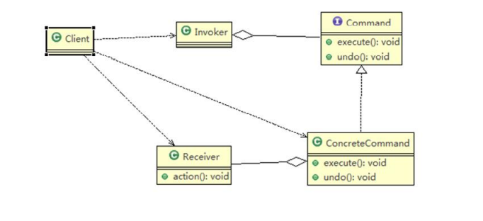
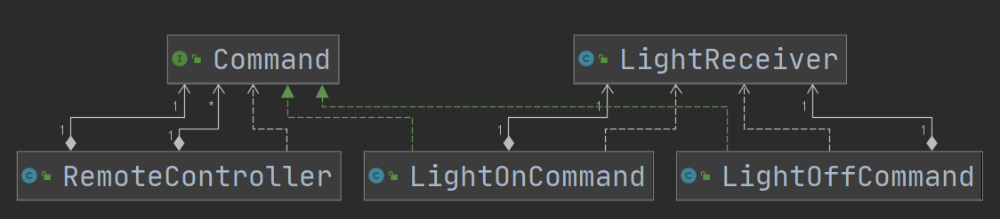
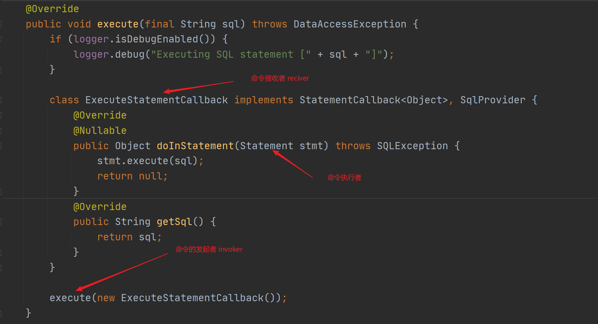
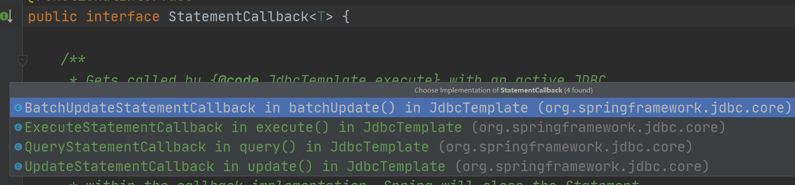
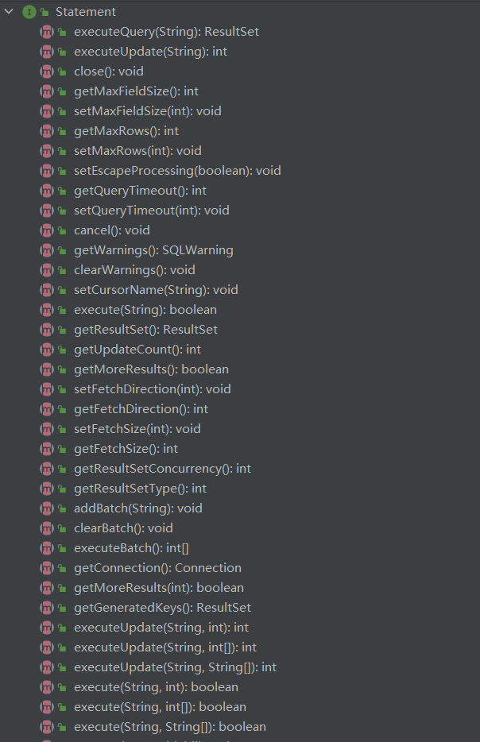

# 命令模式

## 介绍

1. **使得请求发送者与请求接收者消除彼此之间的耦合**，让对象之间的调用关系更加灵活，实现解耦。
2. 同桥接模式非常相似

1）Invoker是调用者角色

2）Command:是命令角色，需要执行的所有命令都在这里，可以是接口或抽象类。

3）Receiver:接受者角色，知道如何实施和执行一个请求相关的操作

4）ConcreteCommand:将一个接受者对象与一个动作绑定，调用接受者相应的操作，实现execute。起到桥梁作用，连接命令和执行命令的对象。

## 在Spring JdbcTemplate中的应用

`StatementCallback`对应命令接口

`execute`对应命令调用者

`ExecuteStatementCallback`相当于具体命令，同时也可以算是命令的接收者。

`Statement`是命令的接收者

### 具体命令

### 命令接收者

