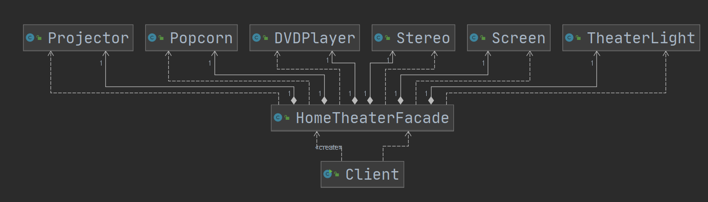
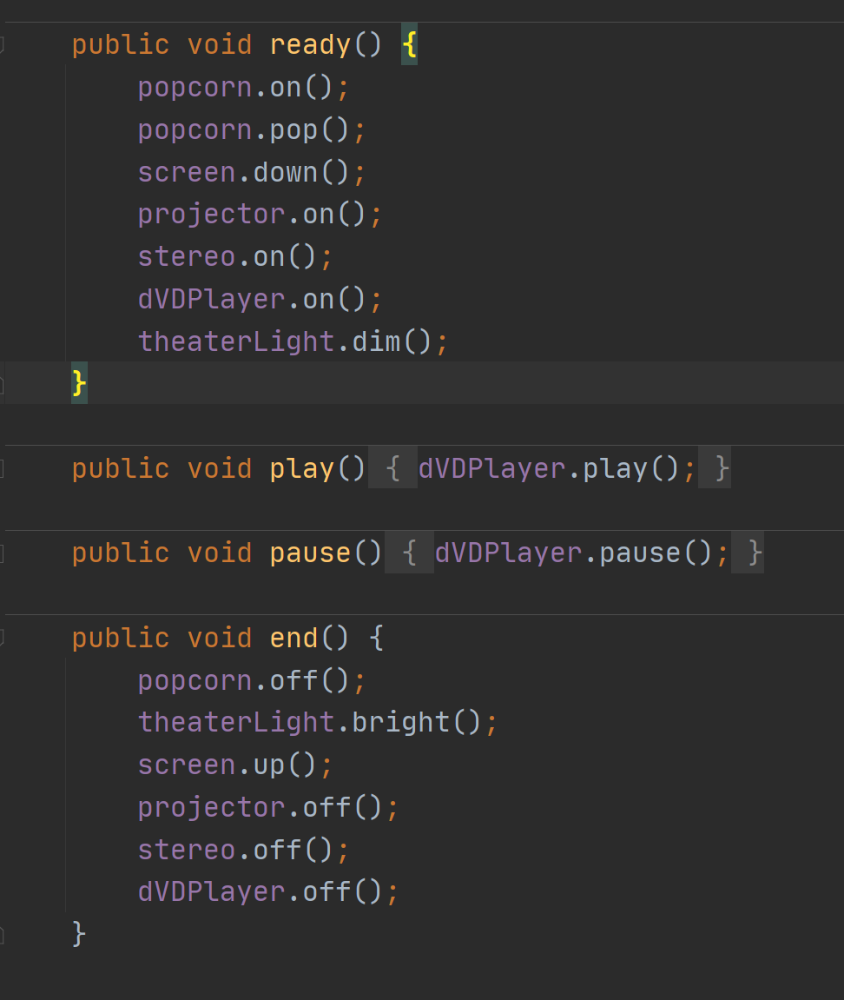

# 外观模式

## 介绍

1. 外观模式**提供了一个高层接口来统一调用一组内部子系统的方法**，提供一个**一致的界面**，屏蔽内部子系统的细节，用户只用调用高层接口，而无需关系内部子系统的实现。

## 类图

ready和end就是外观，一个一致界面。

## 应用场景

对不同的类中相同功能的方法（同名或不同名），创建一个Facade类来统一调用，使得接口更加清晰，提高复用性

## 优缺点

优：

1. 提供一个统一的接口，降低了调用接口的难度，对接口再封装，实现统一调用。
2. 实现客户端与子系统的解耦，让子系统内部更容易维护和扩展。
3. 使得分系更有层次。
