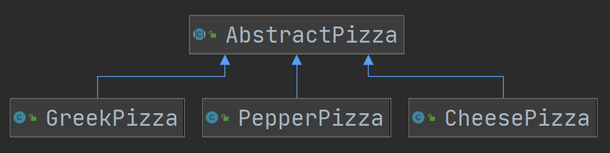
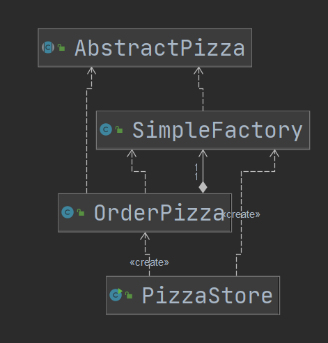
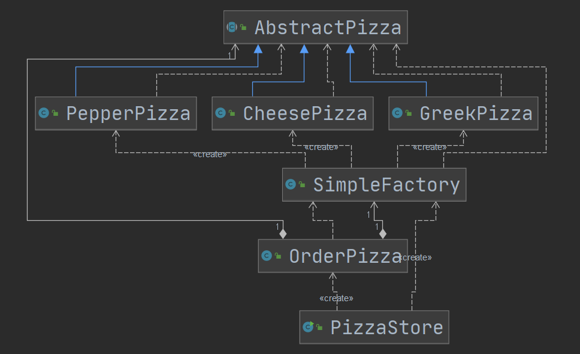
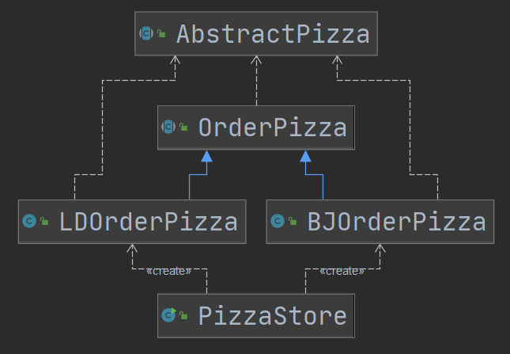
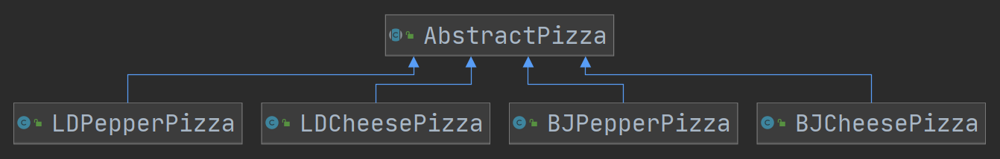
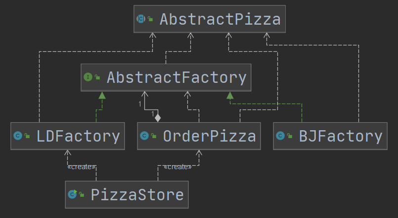

# 	工厂模式

**将实例化对象的代码提取出来，放到一个类中统一管理和维护**，达到和主项目的依赖关系的解耦。提高代码的扩展和维护性。

## 简单工厂模式

### 介绍

简单工厂模式属于创建型模式，是工厂模式的一种。简单工厂模式由一个工厂对象创建出哪一种产品类的实例。简单工厂模式是工厂模式家族中最简单实用的模式。

简单工厂模式**定义了一个对象的类，由这个类封装实例化对象的代码·**·


### 模型

工厂产品类图



客户端类图







## 工厂方法模式

### 介绍

定义一个抽象方法、由其子类实现。定义一个创建对象的工厂方法、由具体子类完成对象创建的实现。

### 模型







## 抽象工厂模式

### 介绍

将**简单工厂中的工厂类**，分解为两层，抽象工厂和具体实现的工厂。

对工厂也进行了抽象


### 模型




工厂方法模式在JDK中的应用

```java
    /**
     * 传入locale获取日历（工厂方法的传入类型）
     */
    public static Calendar getInstance(Locale aLocale)
    {
        return createCalendar(TimeZone.getDefault(), aLocale);
    }

    public static Calendar getInstance(TimeZone zone,
                                       Locale aLocale)
    {
        return createCalendar(zone, aLocale);
    }

    private static Calendar createCalendar(TimeZone zone,
                                           Locale aLocale)
    {
        CalendarProvider provider =
            LocaleProviderAdapter.getAdapter(CalendarProvider.class, aLocale)
                                 .getCalendarProvider();
        if (provider != null) {
            try {
                return provider.getInstance(zone, aLocale);
            } catch (IllegalArgumentException iae) {
                // fall back to the default instantiation
            }
        }

        Calendar cal = null;
	`	// 此处就是工厂方法
        if (aLocale.hasExtensions()) {
            String caltype = aLocale.getUnicodeLocaleType("ca");
            if (caltype != null) {
                switch (caltype) {
                case "buddhist":
                cal = new BuddhistCalendar(zone, aLocale);
                    break;
                case "japanese":
                    cal = new JapaneseImperialCalendar(zone, aLocale);
                    break;
                case "gregory":
                    cal = new GregorianCalendar(zone, aLocale);
                    break;
                }
            }
        }
        if (cal == null) {
            if (aLocale.getLanguage() == "th" && aLocale.getCountry() == "TH") {
                cal = new BuddhistCalendar(zone, aLocale);
            } else if (aLocale.getVariant() == "JP" && aLocale.getLanguage() == "ja"
                       && aLocale.getCountry() == "JP") {
                cal = new JapaneseImperialCalendar(zone, aLocale);
            } else {
                cal = new GregorianCalendar(zone, aLocale);
            }
        }
        return cal;
    }
```


## 小结

1. 将实例化对象的代码提取出来，放到一个类中统一管理和维护，达到和主项目的依赖关系的解耦。提高代码的扩展和维护性。
2. 三种工厂模式（简单工厂模式、工厂方法模式、抽象工厂模式）
3. 设计模式的依赖抽象原则。
