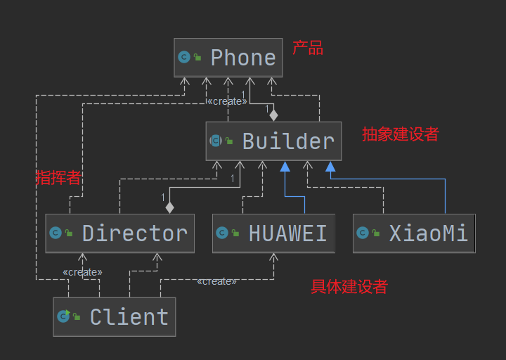
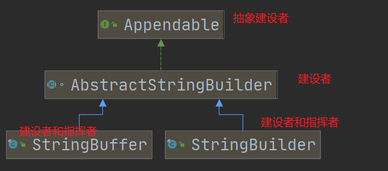
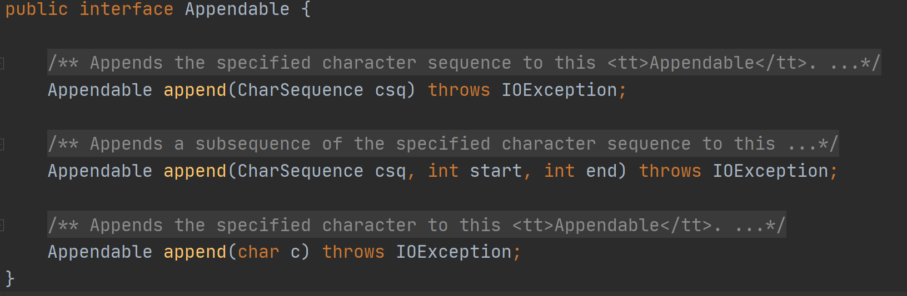
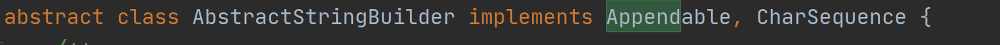
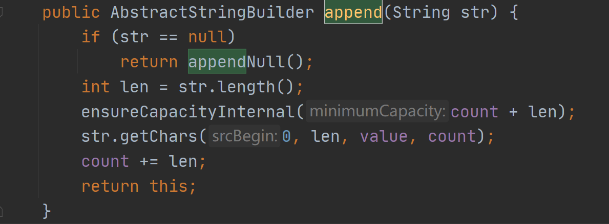
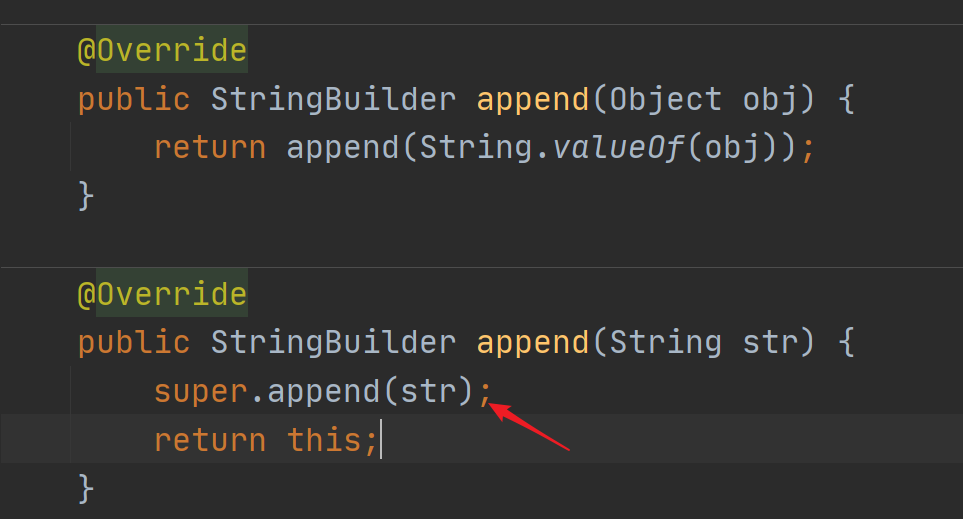

# 建设者模式

## 介绍

建设者模式（Builder Pattern）又叫生成器模式，是一种对象构建模式。它可以将复杂对象的构建过程抽象出来，是这个抽象过程的不同实现可以构造出不同表现（属性）的对象。

建造者模式以一步一步创建一个复杂的对象，它允许用户只通过指定复杂对象的类型和内容就可以构建它们，用户不需要知道内部的具体构建细节。

### 建设者模式的四个角色

1. Product（产品）：一个具体的**产品对象（需要获得的对象）**
2. Builder（抽象建设者）：定义创建一个产品各个部件的**接口/抽象类**
3. ConcreteBuilder（具体建设者）：**实现**接口，构建和装配各个部件
4. Director（指挥者）：构建一个使用Builder接口的对象。隔离客户与对象的生产过程（用户不能调用建设者生产），负责控制产品对象的生产过程（建设者的控制者）。

### 类图

## 建设者模式在JDK中的应用

Appendable是抽象建设者，同时也是产品

AbstractStringBuider是具体建设者，但是由于访问权限不能使用

StringBuilder是建设者实现了append方法，同时又是指挥者，调用父类AbstractStringBuilder的append方法。

## 小结

1. 实现了产品与建设解耦，在产品和建设中添加了一层缓冲（抽象建设者）
2. 可以使用不同的方式（建设者的实现）构建产品。
3. 指挥者使建设具体流程和建设者解耦。
4. 很鸡肋，一般都能想到。