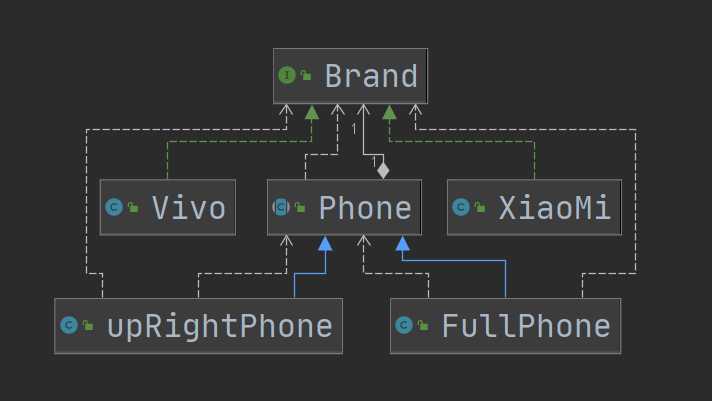
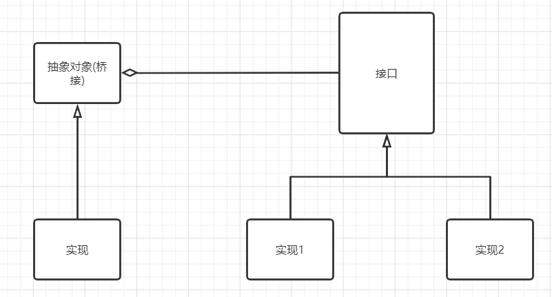
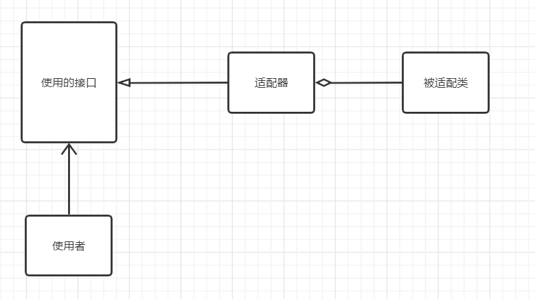

# 桥接模式

## 介绍

1. 将**实现和抽象放在两个不同的类层次**，使两个层次可以独立改变。
2. 是一种**结构性设计模式**。
3. 基于类的最小设计原则，通过封装、聚合及继承让不同的类承担不同的职责，**将抽象与行为实现分离**开来，从而保持各部分的独立性以及各自功能拓展。
4. 通过依赖接口和组合，使用另外一个类。

## 优点

1. 减少类的数量（功能拆分、使之组合）
2. 增加了可扩展性（依赖接口）

## 类图

这里`Phone`完成了`Brand`和`Phone`的桥接，分别保证了`Brand`和`Phone`的可拓展。

## 应用场景

1. JDBC驱动程序

2. 银行转账系统

   转账分类：网上转账、柜台转账、ATM转账

   转账用户类型：普通用户，银卡用户，金卡用户

3. 消息管理

   消息类型：即时消息，延时消息

   消息分类：手机消息，邮件消息，qq消息

## 与适配模式的对比

相同点：都是为了使两个类共同工作

不同：

1. 适配器是为了使用另外一个类的对象的方法，而新建一个适配类，使之共同工作
2. 桥接模式是在类的父类持有要使用对象的接口类。类的父类就担任了桥接者，连接子类和要使用的对象。
3. 桥接是组合（包含），适配器是依赖（使用）

### 桥接模式

### 对象适配器

