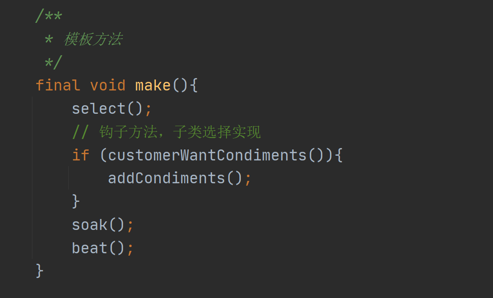
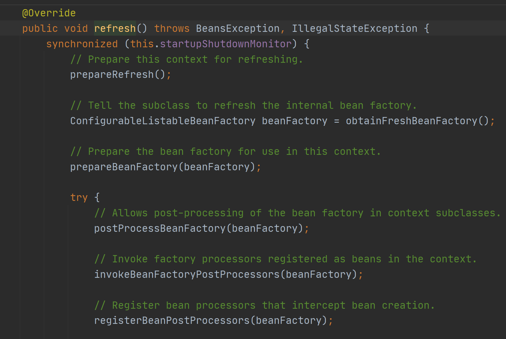
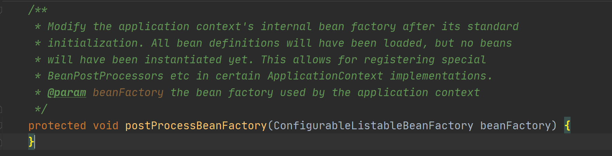

# 模板方法模式

## 介绍

1. 模板方法模式（Template Method Pattern），又叫**模板模式（Template Pattern）**，在一个抽象类公开**定义了执行它的方法的模板。**它的**子类可以按照需要重写方法实现**，但调用将以抽象类中定义的方式进行。
2. **定义了一个操作中的算法骨架**，而**将一些步骤延迟到子类中**，使得子类可以不改变一个算法的结构。
3. 在模板方法模式的父类中，可以定义一个方法（空方法），它**默认不做任何事情**，子类可以选择将其实现，该方法称为“**钩子**”。
4. 行为型模式。

## 在Spring中的使用

模板方法

钩子方法

## 小结

1）基本思想是：算法只存在于一个地方，也就是在父类中，容易修改。需要修改算法时，只要修改父类的模板方法或者已经实现的某些步骤，子类就会继承这些修改。

2）**实现了最大化代码复用**。父类的模板方法和已实现的某些步骤会被子类继承而直接使用。

3）既**统一了算法，也提供了很大的灵活性。**父类的模板方法确保了算法的结构保持不变，同时由子类提供部分步骤的实现。

4）该模式的**不足之处**:每一个不同的实现都需要一个子类实现，**导致类的个数增加，使得系统更加庞大**

5）一般模板方法都加上 final关键字，防止子类重写模板方法。

6）模板方法模式**使用场景**:当要完成在某个过程，该过程要执行一系列步骤，这**一系列的步骤基本相同**，但**其个别步骤在实现时可能不**

**同**，通常考虑用模板方法模式来处理。

