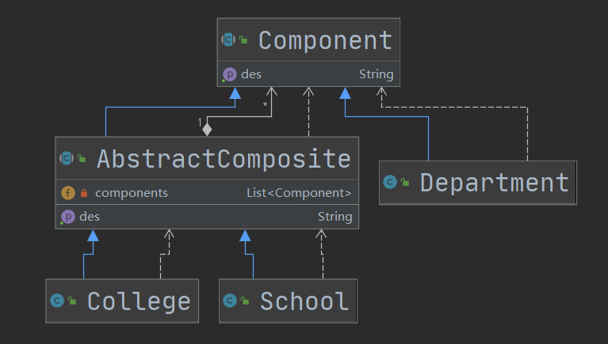

# 组合模式

## 介绍

1. 组合模式（Composite Pattern）又叫部分整体模式，他创建了对象组的**树形结构**，将对象组合成**树状结构以表示”整体-部分“的层次关系。**
2. 结构型模式
3. 对单个对象和组合对象的**访问具有一致性**（继承于同一个接口）。

## 角色

1. Component：接口或抽象类，定义方法，并给一个默认实现
2. Leaf：叶子，不重写Component的方法。
3. Composite：非叶子结点，用于存储子部件，重写Component的接口。

## 类图

