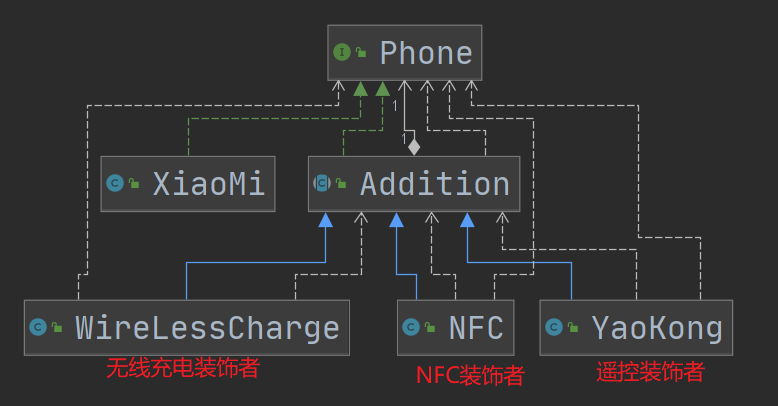
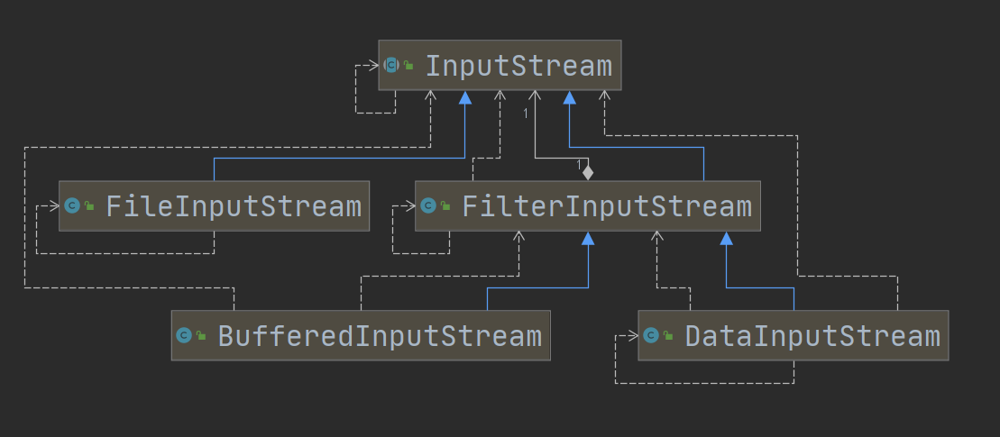

# 装饰者模式

## 介绍

1. 装饰者模式：动态地将功能附加到对象上。在对象功能扩展方面，它比继承更有弹性。
2. 通过一层一层修饰，给对象扩展功能。


## 类图



## 代码示例

```java
// 一层一层被装饰
Phone p = new WireLessCharge(new NFC(new YaoKong(new XiaoMi())));
```


## 在JDK中的使用

