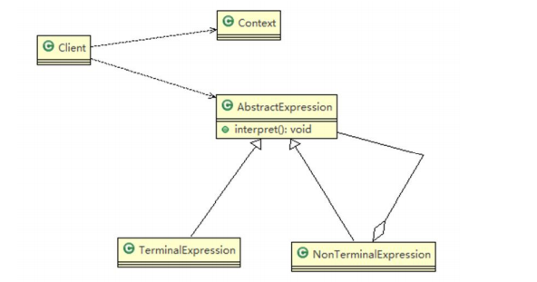
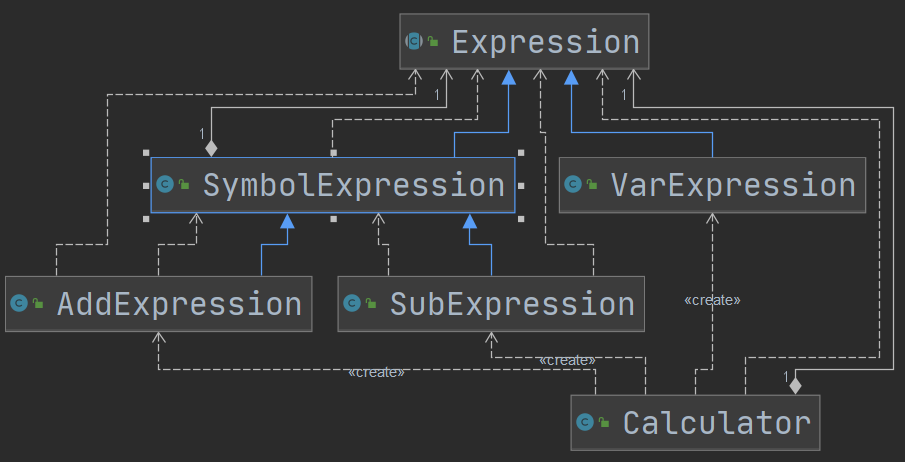
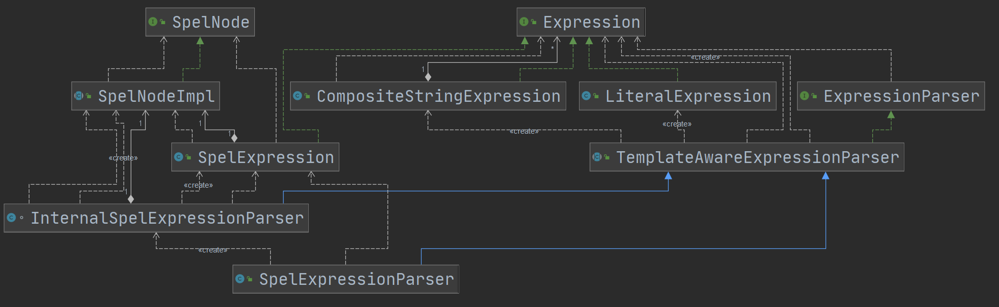

# 解释器模式

## 介绍

1. 解释器模式（Interpreter Pattern）：是指给定一个语言（表达式），**定义它的文法的一种表示，并定义一个解释器，使用该解释器来解释语言中的句子（表达式）。**
2. 可以**将一个需要解释执行的语言中的句子**表示为一个**抽象语法树**，将一些重复出现的问题用一种简单的语言表示
3. 常用于编译器、运算表达式计算、正则表达式。
4. 具有良好的扩展性，但是可能会引起类爆炸。

1）Context:是环境角色,含有解释器之外的全局信息

2）AbstractExpression:抽象表达式，声明一个抽象的解释操作,这个方法为抽象语法树中所有的节点所共享

3）TerminalExpression:为终结符表达式，实现与文法中的终结符相关的解释操作

4）NonTermialExpression:为非终结符表达式，为文法中的非终结符实现解释操作.

5）说明:输入Context 和 TerminalExpression信息通过Client输入即可

在Spring的SpelExpression中有应用

