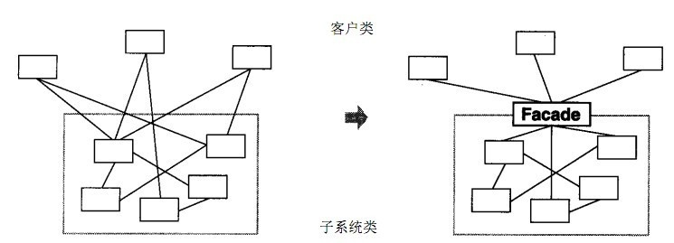

# 设计模式

## 创建型模式

### 单例模式

饿汉式：存在资源浪费

懒汉式：分为线程安全和线程不安全，锁方法、锁对象（DCL）

静态内部类：利用类加载的特性

枚举：天生就是单例模式

#### 使用场景

工具类对象、频繁访问的对象（数据库连接）、资源类。

Spring中的BeanDefinition的isSingleton，容器式单例模式。使用ConcurrentHashMap保存单例对象。

### 工厂模式

用于对**对象的创建和管理**，提高了代码的灵活性， 降低了耦合性。

简单工厂：专门一个类负责创建和管理类

工厂方法：定义一个抽象方法，由子类实现该抽象方法。该方法就是工厂方法。（也就是在类中提供一个根据参数创建不同的对象的方法）

抽象工厂：将简单工厂中的工厂类，拆分成抽象工厂和具体实现的工厂。

#### 使用场景

如Spring的BeanFactory。getBean就是通过传入不同的参数获取不同的对象。

### 原型模式

深克隆，浅克隆

clone方法、对象流

#### 使用场景

避免类复杂的初始化，简化对象的创建过程。

Spring中BeanFactory使用了原型模式，在getBean的时候判断isPrototype并复制对象。

### 建造者模式

生成器模式，一步步创建一个复杂的对象，**将一个复杂的构建与其表示相分离，使得同样的构建过程可以创建不同的表示。**将一个复杂对象的创建简化。

#### 传统的角色

抽象建造者、建造者、产品、指挥者

#### 现在

通过**链式调用**生成不同的配置。通过Buider来创建对象。

如Spring中的BeanDefinitionBuilder。来创建BeanDefinition，设置其类名称（className）、父类描述（parentName）、设置作用范围（scope）等等。

## 结构性模式

### 适配器模式

目的：兼容，让原来因接口不匹配而不能一起工作的两个类可以相互协调工作。

类适配器（继承，使用方法或重写）

对象适配器（持有被适配对象）

接口适配器（方法，默认方法，选择重写，src --->absAdapter(给src的方法默认实现)-->使用new absAdapter(选择重写方法)）

#### 生活中的例子

适配器

### 桥接模式

连接两个类，使之共同工作。将抽象部分与它的实现部分分离（依赖倒转原则），使它们都可以独立地变化。又称为柄体模式或接口模式。

与适配器的区别：适配器是专门有一个类连接另一个类，桥接在其本身完成了连接，在类本身持有另一个类的引用。

### 装饰者模式

动态地给一个对象**增加一些额外的职责**，就增加对象功能来说，装饰模式比生成子类实现更为灵活。也叫包装器模式（Wrapper）增强原有功能或增加新功能。符合合成复用原则。

继承+组合

jdk中io体系中有使用。

### 组合模式

又叫部分整体模式，它创建了对象组的树形结构，如公司的管理结构、文件夹结构。

组合，树型结构，（jdk map hashmap）

### 外观模式

体现的就是 Java 中**封装**的思想。将多个子系统封装起来，**提供一个更简洁的接口供外部调用。**提供统一的对外访问接口。

封装低层细节，隐藏低层具体实现及调用流程，**高层调低层。高层方法统一低层方法调用**。**对外开放高层接口**。高层系统管理使用子系统（模块）。这个接口使得这一子系统更加容易使用。外观模式又称为**门面模式**。

#### 使用场景

MVC，C（Controller）可以看作外观类。

### 享元模式（蝇量模式）

**将可以公用的东西（内部状态）抽取出来放在池中**，把不可共用（外部状态）的单独传入，节省资源。体现的是 **程序可复用** 的特点，共享对象。

#### 使用场景

String常量池，数据库连接池，jdk中Integer的valueof中的使用（-128 -- 127）。

### 代理模式

为对象提供一个替身（代理对象），以控制对这个对象的访问。即**通过代理对象访问目标对象。**

静态代理（类似装饰者模式）

动态代理（jdk代理，接口代理） 

Cglib代理（可以在内存动态的创建对象，而不需要实现接口，属于动态代理的范畴）

#### 目的

拓展目标对象的功能，增强，在方法上增加额外操作，**对方法进行控制**。简化代码，抽取出公共的操作由代理类操作如日志打印等。

#### 使用场景

AOP、日志打印、网络代理，缓存代理。

## 行为型模式

### 模板方法模式

将多个方法放在一个模板方法（规定执行流程），使用时调用模板方法。一些方法需要在子类实现。制定一个算法框架，具体由其子类去实现。

钩子：在父类中默认实现的方法（空方法），子类选择实现。

使用场景

如Spring中refresh方法，就是一个将很多方法放在一起的模板方法。

### 命令模式

将一个请求封装为一个对象，从而使你可用不同的请求对客户进行参数化，对请求排队或记录请求日志，以及支持可撤销的操作。

#### 角色

命令接口、命令接收者/执行者、命令调用者、命令队列

#### 优点

- 将“请求发起者”和“请求执行者”通过命令对象**解耦**。

- **扩展性强**。增加或删除命令非常方便，并且不会影响其他类。
- 封装 “方法调用”，**方便实现 Undo 和 Redo 操作。**
- **灵活性强，可以实现宏命令**。

#### 使用场景

spring中jdbcTemplate中的StatementCallBack是命令接口，execute就是命令发起者， StatementCallBack的子类是具体命令接收者，Statement是命令执行者。

消息队列。

在不知道具体命令时，使用命令模式，可以提高代码的灵活性和可拓展性。

面向接口编程，符合依赖倒转原则。

### 访问者模式

封装一些作用于某种数据结构的各元素操作，它可以在不改变数据结构的前提下定义作用于这些元素的新的操作。

**将数据结构与数据操作解耦**，解决数据结构和操作耦合性问题。

访问者建模式的基本工作原理是：在**被访问者的类**里面加一个**对外提供接待访问者的接口。**

双分派

### 迭代器模式

实现iterator接口

统一遍历方式

作用：隐藏内部数据结构，统一用迭代器遍历

#### 使用场景

Java集合中的集合类基本都实现了Iterator接口，将遍历集合元素和操作分离。

### 观察者模式

注册、管理、通知

实现一对多耦合的解耦。

#### 使用场景

消息队列，来了消息通知其他人

UI监听，当事件发生后，调用监听方法。

### 中介者模式

类似于命令模式（中介者----->遥控器）

实现多对多的松耦合，对其他对象的依赖，转为了对中介者的依赖。

将网状耦合解耦成星状耦合。

### 备忘者模式

用一个类专门用于管理备份，还原另外一个类的状态或属性。

用于记录对象之前的状态，便于在需要时还原到某个状态。

#### 使用场景

回退、存档、备份、数据库的事务管理（回滚）

### 解释器模式

是指给一个语言（表达式），**定义它的文法的一种表示，并定义一个解释器，使用该解释器来解释语言中的句子（表达式）。**

#### 使用场景

编译器、正则表达式、运算表达式

spring中的Spel表达式

### 状态模式

当一个对象的内在状态改变时允许改变其行为，这个对象看起来像是改变了其类。状态模式就是一个关于多态的设计模式。

在《代码整洁之道》、《重构》两本书中都提到：应**使用多态取代条件表达式**。具体就是通过**创建多个状态类来替代条件判断的内容。**

符合OCP原则，使代码更灵活，扩展性更好。减少了条件判断，对每个状态（本来需要条件判断的）封装成状态对象，通过状态对象执行行为，而不需要再判断。

#### 使用场景

网站的用户身份，普通用户、冻结用户、会员、超级会员。

### 策略模式

将不变的和变的分离，并将每一个算法封装起来，而且使它们还可以相互替换。策略模式让算法独立于使用它的客户而独立变化。

用一个成语就可以概括 —— **殊途同归**。当我们做同一件事有多种方法时，就可以将每种方法封装起来，**在不同的场景选择不同的策略（方法）**，调用不同的方法。

提高了代码的灵活性，当有新的策略时，只需创建新的策略，符合OCP原则。

和状态模式很相似， 都是用一个（状态/策略）来控制程序行为，只是**目的**不同。

#### 使用场景

如`Arrays.sort()`方法，比较器`Comparator`就是策略接口。传入不同的比较器（策略），他们得到的结果都是排序后的结果，只是排序方式（策略）不同。

### 责任链模式

将**请求沿着处理者链进行发送， 直至其中一个处理者对其进行处理**。

降低了耦合性，避免过的条件判断，符合开闭原则、单一职责原则。

#### 使用场景

web服务器的一些列拦截器和过滤器

#### 现实中的例子

退课申请：辅导员 --->  学院 --- >  教务处 ---> 学校

简历审批：HR ---> 部门 ----> 所有部门

