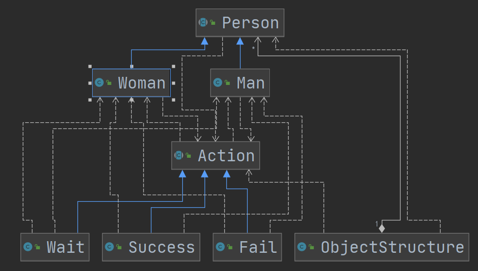

# 访问者模式

## 介绍

1. 访问者模式（Vistor Pattern），封装一些作用于某种数据结构的各元素操作，它可以在不改变数据结构的前提下定义作用于这些元素的新的操作。
2. 主要**将数据结构与数据操作解耦**，解决数据结构和操作耦合性问题 
3. 访问者建模式的基本工作原理是：在被访问者的类里面加一个对外提供接待访问者的接口。
4. 主要应用场景是： 需要对一个对象结构中的对象进行很多不同操作（这些操作彼此没有关联），同时需要避免你让这些操作“污染”这些对象的类，可以选用访问者模式解决。
5. 行为型模式


## 类图


1）Visitor是抽象访问者，为该对象结构中的ConcreteElement 的每一个类声明一个visit操作

2）ConcreteVisitor :是一个具体的访问值实现每个有Visitor声明的操作，是每个操作实现的部分

3）ObjectStructure能枚举它的元素，可以提供一个高层的接口，用来允许访问者访问元素

4）Element定义一个accept方法，接收一个访问者对象

5）ConcreteElement为具体元素，实现了accept方法




## 优点

1）访问者模式符合单一职责原则、让程序具有优秀的扩展性、灵活性非常高

2）访问者模式可以对功能进行统一，可以做报表、UI、拦截器与过滤器，适用于数据结构相对稳定的系统

## 缺点

1）具体元素对访问者公布细节，也就是说访问者关注了其他类的内部细节，这是迪米特法则所不建议的,这样造成了具体元素变更比较困

难

2）违背了依赖倒转原则。访问者依赖的是具体元素，而不是抽象元素

3）因此，如果一个系统有比较稳定的数据结构，又有经常变化的功能需求，那么访问者模式就是比较合适的.


## 单分派和双重分派

Food 类：

```java
public class Food {
    public String name() {
        return "food";
    }
}
```

Watermelon 类，继承自 Food 类：

```java
public class Watermelon extends Food {
    @Override
    public String name() {
        return "watermelon";
    }
}
```

在 Watermelon 类中，我们重写了`name()`方法。

客户端：

```java
public class Client {
    @Test
    public void test() {
        Food food = new Watermelon();
        System.out.println(food.name());
    }
}
```

思考一下，在客户端中，我们 new 出了一个 Watermelon 对象，但他的声明类型是 Food，当我们调用此对象的 name 方法时，会输出 "food" 还是 "watermelon" 呢？

了解过 Java **多态特性**的同学都知道，这里肯定是输出 "watermelon" ，因为 **Java 调用重写方法时，会根据运行时的具体类型来确定调用哪个方法。**

再来看一段测试代码：

```java
public class Client {
    @Test
    public void test() {
        Food food = new Watermelon();
        eat(food);
    }

    public void eat(Food food) {
        System.out.println("eat food");
    }

    public void eat(Watermelon watermelon) {
        System.out.println("eat watermelon");
    }
}
```

在这段代码中，我们仍然 new 出了一个 Watermelon 对象，他的声明类型是 Food，在客户端中有`eat(Food food)`和`eat(Watermelon watermelon)`两个重载方法，这段代码会调用哪一个方法呢？

我们运行这段代码会发现输出的是：

```text
eat food
```

这是由于 **Java 在调用重载方法时，只会根据方法签名中声明的参数类型来判断调用哪个方法，不会去判断参数运行时的具体类型是什么。**

从这两个例子中，我们可以看出 Java 对重写方法和重载方法的调用方式是不同的。

- 调用**重写方法**时，与**对象的运行时类型**有关；
- 调用**重载方法**时，只与**方法签名中声明的参数类型**有关，与对象运行时的具体类型无关。

了解了重写方法和重载方法调用方式的区别之后，我们将其综合起来就能理解何谓双重分派了。

测试代码：

```java
public class Client {
    @Test
    public void test() {
        Food food = new Watermelon();
        eat(food);
    }
	// 单分派，一个是静态分派、一个动态分派
    public void eat(Food food) {
        System.out.println("eat food: " + food.name());
    }

    public void eat(Watermelon watermelon) {
        System.out.println("eat watermelon" + watermelon.name());
    }
}
```

在这段测试代码中，仍然是 new 出了一个 Watermelon 对象，它的声明类型为 Food。运行`test()`函数，输出如下：

```text
eat food: watermelon
```

在面向对象的编程语言中，我们将方法调用称之为`分派`，这段测试代码运行时，经过了两次分派：

- 调用重载方法：选择调用`eat(Food food)`还是`eat(Watermelon watermelon)`。虽然这里传入的这个参数实际类型是`Watermelon`，但这里会调用`eat(Food food)`，这是由于调用哪个重载方法是在编译期就确定了的，也称之为`静态分派`。
- 调用重写方法：选择调用`Food`的`name`方法还是`Watermelon`的`name`方法。这里会根据参数运行时的实际类型，调用`Watermelon`的`name`方法，称之为`动态分派`。

单分派、双重分派的定义如下：

> 方法的接收者和方法的参数统称为方法的宗量。 根据分派基于多少个宗量，可以将分派分为单分派和多分派。单分派是指根据一个宗量就可以知道应该调用哪个方法，多分派是指需要根据多个宗量才能确定调用目标。

这段定义可能不太好理解，通俗地讲，单分派和双重分派的区别就是：程序**在选择重载方法和重写方法时**，如果两**种情况都是动态分派的，则称之为双重分派**；如果**其中一种情况是动态分派，另一种是静态分派，则称之为单分派。**由于Java是单分派语言，重写方法是动态分派，而重载方法是静态分派，所以重载方法需人为实现动态分派（认为判断调用），才能使用双分派。

