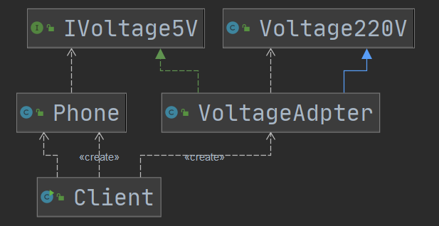
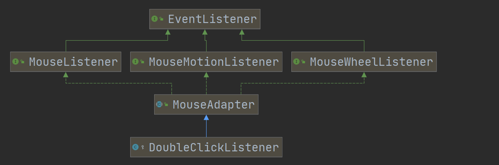
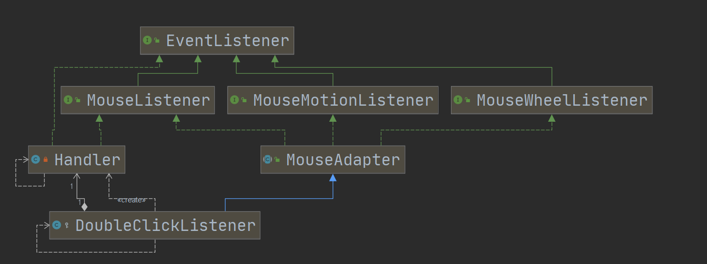
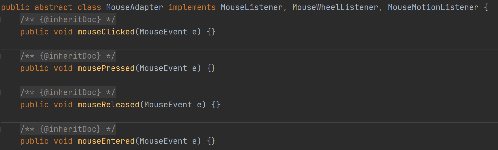
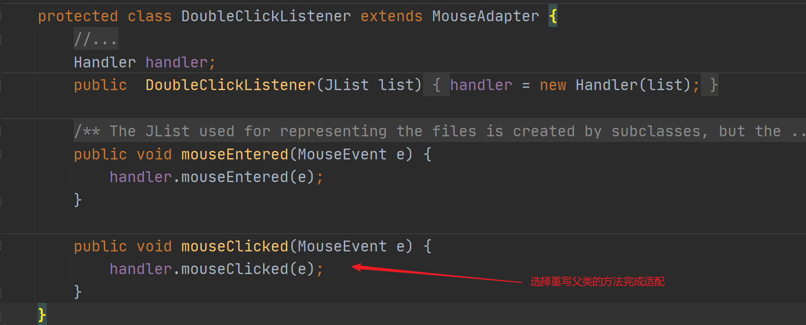
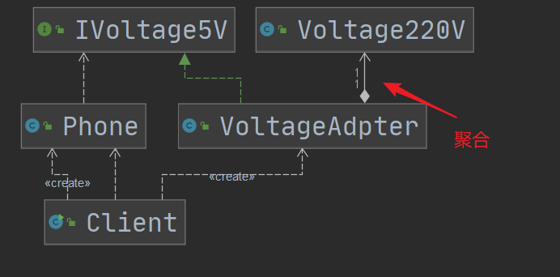

# 适配器模式

## 介绍

适配器模式（Adapter Pattern）将某个类的接口转换成客户端期望的另外一个接口，**只要目的使兼容性**，**让原本因接口不匹配不能一起工作的两个类可以协同工作**。**其别名为包装器（Wrapper）**

适配器模式属于**结构型模式**

主要分为三类：**类适配器模式、对象适配器模式、接口适配器模式。**

### 用途

解决兼容性、使两个类可以协同工作

### 主要角色

1. Adapter类
2. 被适配类
3. 目的类


## 类适配器

直接继承被适配类，同时实现目的接口，在适配类中完成被适配类到目的接口的转换。

优点：可以重写被适配的方法

缺点：灵活  Java是单继承




## 接口适配器

接口适配器模式**也称为缺省适配器模式**

不需要实现接口提供的方法时，可以先设计一个抽象类实现接口，并为该接口中每个方法**提供一个默认实现（空方法**），抽象类的子类可有选择地**覆盖父类的默写方法**实现需求（达到适配）。

优点：减少重复代码（选择重写需要的方法）、灵活










`MouseAdapter`就是缺省适配器




### 示例代码

```java
/**
 * @author MaYunHao
 * @version 1.0
 * @date 2020/11/11 15:38
 */
public interface Interface4 {
    void m1();
    void m2();
    void m3();
    void m4();
}
```

```java
/**
 * @author MaYunHao
 * @version 1.0
 * @date 2020/11/11 15:38
 * 缺省适配器
 */
public class AbstractAdapter implements Interface4 {
    @Override
    public void m1() {

    }

    @Override
    public void m2() {

    }

    @Override
    public void m3() {

    }

    @Override
    public void m4() {

    }
}
```

```java
/**
 * @author MaYunHao
 * @version 1.0
 * @date 2020/11/11 15:40
 */
public class Client {
    public static void main(String[] args) {
        Interface4 i = new AbstractAdapter(){
            @Override
            public void m1() {
                System.out.println("我用的时候再重写方法");
            }
        };
        i.m1();
    }
}
```


## 对象适配器

实现目的接口、在适配类中**持有被适配类的对象**，通过在目的方法中调用被适配类对象的方法，实现适配。



优点：通过聚合，避免Java单继承带来的局限性

合成复用原则，多用组合、少用继承。


